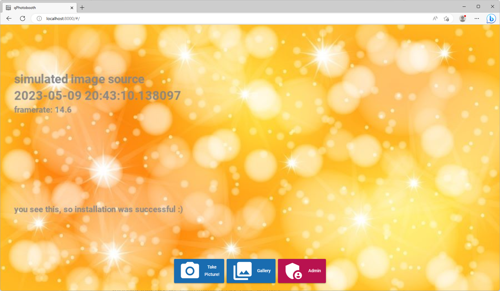
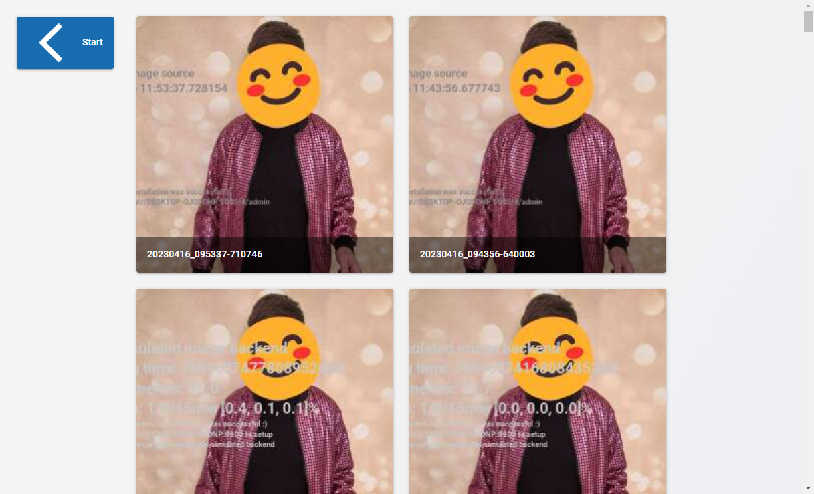
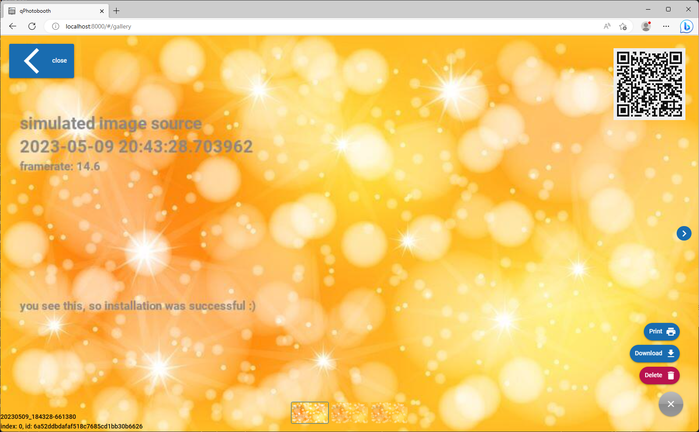
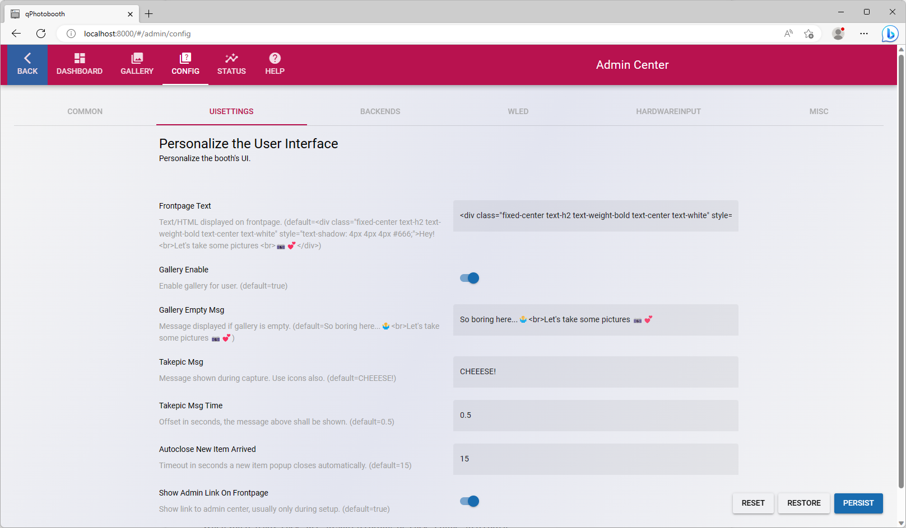
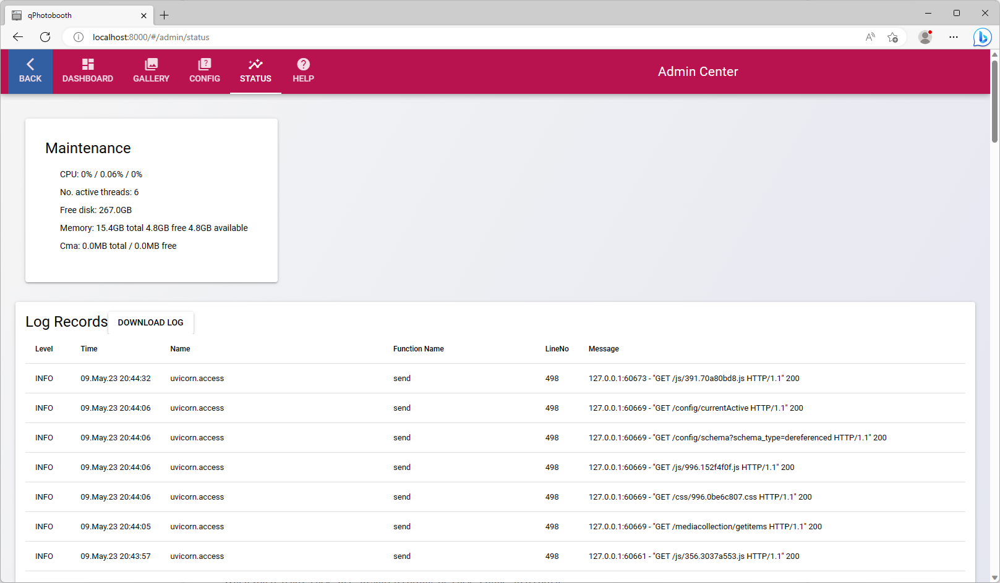

# Photobooth App


[](https://github.com/mgrl/photobooth-app/actions/workflows/ruff.yml)
[](https://github.com/mgrl/photobooth-app/actions/workflows/pytests.yml)
[](https://codecov.io/gh/mgrl/photobooth-app)

The photobooth app is written in Python 🐍 and coming along with a modern Vue frontend.

---

**[Features](#heart_eyes-features)** - **[Supported Cameras](#camera-supported-cameras)** - **[Installation](#wrench-installation)** - **[Troubleshooting](#interrobang-troubleshooting)** - **[Documentation](https://mgrl.github.io/photobooth-docs/)**

## :heart_eyes: Features

- 📹 camera live preview with shortest delay as possible, permanent video live view in background
- ⚡️ optimized for speed, live stream hardware accelerated on rpi, cpu load < 20%
- 🫶 several camera backends supported for high quality stills and livestream
- 💡 WLED support signaling photo countdown and feedback to the user when the photo is actually taken
- 🤝 Linux 🐧, Raspberry Pi 🍓 and Windows 🪟 platforms supported

## :camera: Supported Cameras

The photobooth app's Python backend allows to use different camera types on Linux and Windows platforms:

- Raspberry Pi Camera Module 1/2/3 (with or without autofocus)
- Arducam cameras (with or without autofocus)
- DSLR camera via
  - gphoto2, Linux
  - digicamcontrol, Windows (not yet implemented)
- webcams (via opencv2 or v4l)

The app controls camera's autofocus, handles led signaling when a photo is taken and streams live video to photobooth.

The booth is made from 3d printed parts, [see the documentation ✍ over here](https://github.com/mgrl/photobooth-3d).
The camera support is mostly ready to use, the frontend is not production ready yet.
Use [photobooth project](https://photoboothproject.github.io/) as frontend.

## :nail_care: Screenshots









## :wrench: Installation

### Prerequisites

- Python 3.9 or later
- Camera supported by one of the backends
- Raspberry Pi Bullseye with libcamera stack for picamera modules
- git installed (automatic install on linux, download manually for windows platform)
- [works probably best with 3d printed photobooth and parts listed in the BOM](https://github.com/mgrl/photobooth-3d)

The photobooth app can be used standalone but is not feature complete yet.
Anyway, it integrates well with the fully blown [photobooth project](https://photoboothproject.github.io/),
see description below how to achieve integration.

### Installer

Execute the installer following the commands below, helping to setup on a Linux or Windows system:

```sh
curl -o install.py https://raw.githubusercontent.com/mgrl/photobooth-app/main/install.py
python install.py
```

Start the app and browse to <http://localhost:8000>, start using the app.

```sh
cd photobooth-app
python -m photobooth
```

### Integrate Photobooth-Project and this Photobooth-App

Following commands have to be set in photobooth project to use this app as streamingserver.
Replace <http://photobooth> by the actual hostname or localhost if on same server.

```text
take_picture_cmd: curl -o "%s" localhost:8000/aquisition/still | echo Done
take_picture_msg: Done
pre_photo_cmd: curl http://photobooth:8000/aquisition/mode/capture
post_photo_cmd: curl http://photobooth:8000/aquisition/mode/preview
preview_url: url("http://photobooth:8000/aquisition/stream.mjpg")
background_defaults: url("http://photobooth:8000/aquisition/stream.mjpg")
```

## :mega: Changelog

see separate file:
<https://github.com/mgrl/photobooth-app/blob/main/LICENSE.md>


### :copyright: License

The software is licensed under the MIT license.  

### :tada: Donation

If you like my work and like to keep me motivated you can buy me a coconut water:

[](https://www.paypal.com/donate/?hosted_button_id=8255Y566TBNEC)
